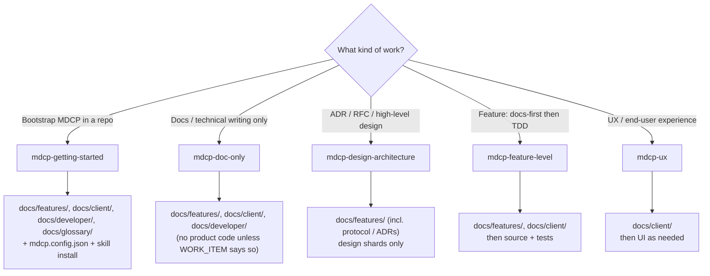

# MDCP (parent skill)

Host-agnostic **documentation system** Agent Skill for MDCP. Prefer this over
IDE extensions when you want durable, sharded docs that agents and humans can
maintain as ideas keep coming.

This **parent skill** is the intended agent entrypoint. Complementary archetype
skills extend it for specific documentation architectures.

Install help: [references/install.md](references/install.md).
What compile / check / refs mean and CLI commands:
[references/cli-and-scripts.md](references/cli-and-scripts.md).

## Hard rules

- **NEVER** invent MDCP workflow when this skill already defines it — follow the skill first.
- **NEVER** hand-edit vendored skill files under `.agents/skills/` for
  repo-specific guidance — use complementary skills, `docs/extensions/`, or
  normative shards.
- **NEVER** edit generated compile output (`docs/_build/`, compiled publish
  targets) — fix shards and recompile.
- **NEVER** dump whole monoliths into context — discover with host search (`rg`,
  IDE search), then read **one shard** at a time.
- **NEVER** write functional product code for a docs/feature change without
  docs-first shards when the repo follows that convention.
- **ALWAYS** run `mdcp check` (or `docs:check`) before trusting compiled output.

## Quality Assurance (QA) Principles

When applying MDCP, act as a complementary partner to other skills and systems.
These habits keep docs trustworthy while the product keeps changing:

- **Always reference doc shards:** Insert yourself into the process so the
  current task points at the correct documentation shards before work spreads.
- **Update as you go:** Continuously update documentation as work progresses so
  shards and code do not drift apart mid-change.
- **Small batches / one focused feature:** Prefer one shippable slice per branch
  or session. Oversized requests produce tangled diffs and half-updated docs;
  split the request (and the shards) before coding so each change stays
  reviewable and documentation can stay current with it.
- **Current docs only:** Shards must describe the product **as it works now**.
  When behavior or guidance changes, remove superseded or stale text from
  durable docs — do not leave “old way” sections for archaeology. Git history
  preserves prior wording; consumer notice of breaking or removed behavior
  belongs in the **changeset** (folded into package CHANGELOGs at release),
  not in feature/client/developer shards. Never link durable shards or ADRs to
  pending `.changeset/*.md` files — those notes are temporary.
- **Capture ambiguity:** Identify ambiguous terms or language and write the
  clarified details into specific shards.
- **Break it down:** Organize information into the smallest useful pieces
  (shards) so agents can load one shard at a time instead of drowning in
  monoliths.
- **No code in docs:** Put intent, contracts, and acceptance criteria in
  shards — not implementation. Code samples and internals drift; the codebase
  is the source of truth for how something is built. This matches
  **What belongs where** below.
- **No temp info or backlogs:** Do not record temporary project information,
  tickets, incident logs, or migration backlogs and planning in the durable
  documentation. That information belongs in issue tracking and project
  planning tools. Pending `.changeset/*.md` files are temporary release notes —
  write them for the release pipeline; do not link them from ADRs or other
  durable docs.
- **Record planning locations:** Record where planning documents and
  architectural decisions live so agents can find them without stuffing plans
  into durable product shards.

## What belongs where

Documentation is a **first-class artifact** alongside code. We use a **spec-driven** workflow: shards hold context, intent, and the high-level meta plan; **implementation details stay in code**.

The default MDCP structure acts as the "batteries-included" **Code Repository Archetype**. This fundamental four-tier taxonomy enforces strict boundaries to prevent the docs system from falling apart as it scales:

| Guide             | Holds                                                                                    | Does not hold                                                                 |
| ----------------- | ---------------------------------------------------------------------------------------- | ----------------------------------------------------------------------------- |
| `docs/features/`  | How the plumbing works — capabilities, design, contracts, acceptance criteria            | Maintainer runbooks, live eval suites, contributor setup, impl walkthroughs   |
| `docs/client/`    | How a specific persona finds value using the software — outcomes, flows, usage           | Internal architecture, skill-authoring, live evals, maintainer-only workflows |
| `docs/developer/` | How to work on the repo — setup, layout, validation, skill development, live skill evals | Product capability narrative or end-user tutorials                            |
| `docs/glossary/`  | Shared terms and disambiguation                                                          | General code snippets                                                         |

**Placement test:** If only contributors to this repo need the shard, put it in `docs/developer/`. If consumers of the product need it, use `docs/features/` or `docs/client/`. The same topic may span tiers (for example Agent Skill product delivery vs maintainer live evals).

_(Note: The MDCP engine itself is domain-agnostic. Non-code projects can define entirely different guide tiers/archetypes while still using the same compile and validation checks.)_

## Authoring rules

- Shards under `docs/**/` are the source of truth.
- Use `#` headings in shards; mdcp demotes them during compile.
- After changing a guide's link order (e.g., in `index.md`), run `mdcp compile` — there is no separate manifest sync step.
- After inserting `[text](#slug)` cross-links, run `mdcp check` so fragments match **compiled** slugs (use `mdcp refs list` if you need to inspect the registry).

## When to use

- **PROACTIVELY on ANY feature, bugfix, or architectural task:** MDCP must be involved in the entire process. Before writing code, trace the requirement back to documentation. Consider the end-user problems and ensure helpful docs exist or are created.
- Authoring or refactoring sharded markdown under a docs root
- Bootstrapping MDCP agent guidance (install parent skill first)
- Cross-links / refs while writing docs
- Extending guidance via complementary skills or local `docs/extensions/` when needed

## Execution steps

### 1. Prefer the parent skill

1. Follow this skill’s workflow.
2. Install / rediscover via:

```bash
npx skills add betsalel-williamson/mdcp --skill mdcp
```

### 2. Prefer smallest context

Discover the relevant shard with host search (`rg`, IDE search) or the guide
`index.md`, then open **one** `.md` shard. Broader compiled monolith reads are last
resort.

### 3. Edit shards, then validate

1. Edit shards under guides in `compileOrder`.
2. Update `index.md` / `shards.md` when adding files.
3. **Build** compiled docs from shards, then **validate** the docs tree
   (see [references/cli-and-scripts.md](references/cli-and-scripts.md) for what
   these mean):

```bash
mdcp compile
mdcp check
```

### 4. Code Formatting and Linting

If the user asks to set up formatting or linting, they should install `prettier`, `markdownlint-cli2`, and `@bwilliamson/mdcp-presets` via their package manager. (Note: MDCP is flexible; if the user prefers other formatting or linting tools, you can integrate those instead.)

To automatically format documents using the default tools:

```bash
mdcp fix
```

To run prose linting (requires Vale):

```bash
mdcp prose
```

### 5. Helper Commands

Task-type instructions live in independent helper skills. Once the MDCP CLI is installed, you can invoke these helpers directly.

| Helper Skill               | Description                                            |
| -------------------------- | ------------------------------------------------------ |
| `mdcp-getting-started`     | Bootstrap MDCP in a new repository                     |
| `mdcp-doc-only`            | Documentation-only work                                |
| `mdcp-design-architecture` | High-level design and planning (RFCs, ADRs)            |
| `mdcp-feature-level`       | Implement and document features (docs-first, then TDD) |
| `mdcp-ux`                  | User experience design and client-guide updates        |

**Helper routing (task → skill → artifacts):** Pick **one** helper for the current `WORK_ITEM` (one focused batch per branch). Edit only the artifact paths that helper owns; keep shards current; put no implementation code in durable docs; run `mdcp check` before trusting compiled output.



Bootstrap example:

```text
/mdcp-getting-started
```

Hosts that can fork work (Task tool, `context: fork`, and similar) may run the chosen helper in an isolated agent; otherwise follow it in the main session.

When no `mdcp.config.json` yet: create docs root + config + guide dirs, install
the parent skill under `.agents/skills/mdcp/`, optionally add
`@bwilliamson/mdcp-presets`, then compile and check.

## Zero-install

Copy `.agents/skills/mdcp/` into the consumer repo (portable default). Hosts may
also read `.github/skills/` or `.claude/skills/`.
