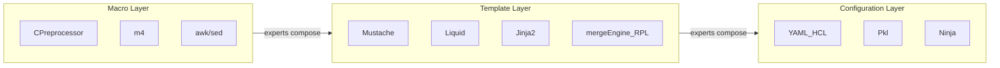
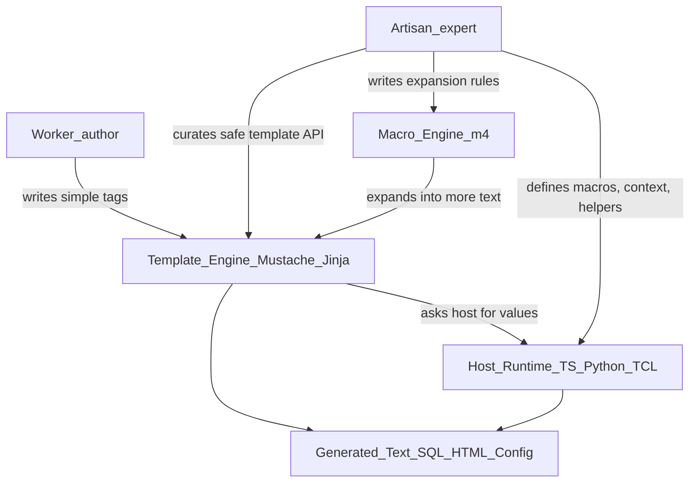

# Templating Evolution and Tool Landscape

This document captures research into macro processors, template languages, and configuration systems. It explains why tools like `mergeEngine` (the legacy RPL-style engine this project ports) were invented independently, why the industry never consolidated on a single solution, and what that means for how we move forward.

This research **complements** [ADR-001: Pkl adoption](./adr-001-adopt-pkl.md). ADR-001 remains valid for configuration workloads where a typed, standalone language and mature ecosystem are the right fit. Additional study of Mustache, `m4`, and related tools clarifies where a host-integrated template engine still earns its place.

For the current V2.1 design direction, see [V2 mathematical design](./v2_mathematical_design.md).

## 1. A Spectrum of Text Transformation Tools

Text transformation tools are not one category. They sit on a spectrum from **low-level macro expansion** to **high-level, domain-specific projection languages**. Each layer trades power for accessibility.

| Layer             | Representative tools                          | Primary question answered                                         | Typical user                           |
| :---------------- | :-------------------------------------------- | :---------------------------------------------------------------- | :------------------------------------- |
| **Macro**         | `m4`, C preprocessor, `awk`                   | "How do I generate arbitrary text by repeating and substituting?" | Build engineers, systems programmers   |
| **Template**      | Mustache, Liquid, Jinja2, Twig, `mergeEngine` | "How do I project structured data into a target format safely?"   | Application developers, report authors |
| **Configuration** | YAML, HCL, Pkl, Jsonnet                       | "How do I describe system state with validation and composition?" | Platform engineers, SREs               |

The same _problem_—turning data into text—shows up at every layer. The difference is **who is expected to author the logic** and **how much of the host runtime is exposed**.

## 2. The Artisan vs. Worker Pattern

A recurring industry pattern explains much of the fragmentation:

1. **Artisans** (language designers, framework authors, senior engineers) use powerful, general tools close to the host language or macro layer.
2. **Workers** (template authors, operators, content editors) use a **restricted surface** that hides complexity behind a small vocabulary.

**Why this matters:** Template languages are not failed programming languages. They are **deliberately incomplete** interfaces. An expert encodes domain knowledge once (SQL parameter binding, pagination, environment-specific keys). A worker repeats a stable pattern (`{{#rows}}...{{/rows}}`) without touching the machinery underneath.

`mergeEngine` fits this pattern from the artisan side: its mathematical operators (`<*>`, `<*?>`, `<+>`) are compact encodings of transformations an expert would otherwise express in TCL or shell. The syntax is dense because it was optimized for **expert throughput**, not casual readability.

## 3. Why mergeEngine / RPL Was Developed Independently

`mergeEngine` (often referred to in this repo as the legacy RPL-style engine) was not a reinvention of Jinja. It solved a different bundle of constraints:

| Constraint          | Web template tools (Jinja, Django)      | mergeEngine / RPL                                        |
| :------------------ | :-------------------------------------- | :------------------------------------------------------- |
| **Output domain**   | HTML pages for browsers                 | SQL, configs, reports, batch artifacts                   |
| **Execution model** | Request/response, mostly static context | Pipeline transforms over live or batch data              |
| **Mental model**    | Imperative control flow in templates    | Mathematical combination of template × data              |
| **Indirection**     | Limited; mostly literal keys            | Deep: templates inside array names, slices, conditionals |
| **Host coupling**   | Framework-specific runtimes             | TCL / JS host with registered functions                  |

The [Language orthogonality](./language_orthogonality.md) principle captures what made RPL distinctive: **any position that expects a value can accept a nested template that resolves to that value**. That is closer to macro composition than to typical MVC view templates.

ADR-001 noted that early exploration of `m4`, Ninja, and Django templates did not fully capture this "data as metadata" indirection. That gap is understandable: most mainstream template tools optimize for **view rendering**, not for **symbolic data transformation** across arbitrary text domains.

## 4. Macro Tools vs. Template Languages: The Gap

### What macros excel at

Tools like `m4` and `awk` treat input as **text to be rewritten**. They are maximally flexible:

- Recursive expansion (`m4` rescans output for more macros)
- No built-in notion of "data context" vs. "template author"
- Minimal guardrails—expert tools for expert users

### What templates add

Template engines introduce **structure**:

- A **context** (data model) separate from the template text
- **Delimiters** that mark logic vs. literal output
- **Escaping** and output-encoding conventions
- **Sandboxing** (logic-less templates, allowlisted functions)

### The inherent difficulty

Even "simple" template languages are hard to use well because they sit at a **boundary**:

1. **Two languages at once:** The template syntax _and_ the host language (for context, helpers, macros).
2. **Two execution phases:** Parse template → resolve context → stringify → sometimes re-parse (macro expansion).
3. **Two security domains:** Template injection (SSTI) vs. output-domain injection (XSS, SQLi).
4. **Impedance mismatch:** Templates want strings; hosts want objects, async, live state.

This is why users feel friction even when the template "only" has `{{ name }}`. The hard part is not the tag—it is **where logic lives**, **when data is fetched**, and **what happens if user input contains delimiter characters**.

## 5. Why the Industry Never Consolidated

No single tool won because "text generation" is not one problem. Tools diverge along axes that are genuinely incompatible in one design:

| Axis                 | One end                              | Other end                          | Example split                 |
| :------------------- | :----------------------------------- | :--------------------------------- | :---------------------------- |
| **Logic placement**  | Logic-less (Mustache)                | Full language in templates (Jinja) | Security vs. convenience      |
| **Host integration** | Standalone config language (Pkl)     | Embedded in app runtime (Liquid)   | Portability vs. live bindings |
| **Output safety**    | HTML auto-escape                     | Raw SQL / shell generation         | Context-specific escapers     |
| **Author audience**  | Operators / designers                | Senior engineers                   | Syntax complexity budget      |
| **Evaluation model** | Compile-time (Ninja)                 | Runtime (most web engines)         | Build speed vs. dynamic data  |
| **Type system**      | Untyped strings (legacy mergeEngine) | Static types (Pkl)                 | Flexibility vs. early errors  |

Consolidation would require one tool to be simultaneously:

- Safe for untrusted authors **and** powerful for experts
- Embedded in every host **and** portable across hosts
- Optimized for HTML **and** for SQL, shell, and config
- Logic-less **and** Turing-complete enough for complex reports

That combination is a design contradiction, not a market failure.

## 6. What Industry Leaders Optimize For

Mature systems do not pick "the best template language." They **separate concerns** and accept tool pluralism:

### Security boundaries

- **Logic-less templates** (Mustache, Handlebars): push `if`/`for` into the host context.
- **Allowlisted functions:** templates call a fixed registry, not arbitrary code.
- **Trusted vs. untrusted output:** explicit types for strings that may be re-parsed (see [V2 mathematical design](./v2_mathematical_design.md) `TrustedTemplate`).
- **Context-aware escaping:** HTML, SQL, and shell each need different encoding rules ([Secure templating guide](./secure_templating_guide.md)).

### Separation of orchestration and presentation

- **Orchestration** (fetch data, validate, paginate) lives in the host or a typed config layer (Pkl, application code).
- **Presentation** (layout, field order, labels) lives in templates.
- Violating this boundary produces "template programs" that are harder to test than the code they replaced.

### Composability without Turing-complete templates

- Pipes, sections, and macros compose **without** adding variables, assignment, or `break` to the template language.
- Experts implement composition in TypeScript; workers consume stable section tags.

### Observability and reviewability

- Golden-file recipes, parse diagnostics, and linear data-flow syntax (pipes, sections) exist so humans and LLMs can review templates quickly ([V2 design goals](./v2_design_goals.md)).

## 7. Relating the Research to This Project

### ADR-001 (Pkl) — still valid for its lane

[Pkl](https://pkl-lang.org/) is a strong fit when:

- Configuration is the **primary artifact** (not a view over live runtime state)
- Static typing and LSP tooling outweigh embedded runtime integration
- A standalone evaluator and package ecosystem are acceptable dependencies

The PoC in ADR-001 demonstrated that many `mergeEngine` recipes map cleanly to Pkl's `map`, `joinToString`, and typed property access.

### Mustache / m4 hybrid — a better fit for another lane

Further research suggests a complementary architecture for workloads that ADR-001 did not fully address:

- **Live TypeScript runtimes** (proxies, getters, async context)
- **Template-as-projection** over data prepared by the host
- **Jinja/Liquid-class output complexity** without growing a procedural template parser
- **Legacy mathematical semantics** (map, cross-product, conditional vectors) expressed via host-prepared context

This is the direction documented in [V2 mathematical design](./v2_mathematical_design.md): Mustache-style sections for workers, TypeScript macros for artisans, strict security boundaries for production.

### How to choose (pragmatic decision guide)

| Need                                                       | Favor                                      |
| :--------------------------------------------------------- | :----------------------------------------- |
| Typed config modules, CI validation, minimal host coupling | Pkl (per ADR-001)                          |
| Dynamic SQL / reports driven by live app state             | Host-integrated template engine            |
| Untrusted template authors                                 | Logic-less sections + allowlisted context  |
| Expert-authored batch transforms with deep indirection     | Macro expansion + typed trusted boundaries |
| Greenfield with no legacy templates                        | Pkl or plain TypeScript string builders    |
| Legacy `mergeEngine` parity + modern syntax                | This project's V2.1 hybrid path            |

## 8. Moving Forward

The goal is not to declare a single winner among Pkl, Mustache, `m4`, and Jinja. The goal is to **place each tool in its lane** and evolve this repository deliberately:

1. **Preserve the RPL insight:** Templating is mathematical data transformation; templates combine with data rather than execute as scripts.
2. **Adopt the artisan/worker split:** Workers write sections and variables; artisans implement transforms in TypeScript (or Pkl for config-only paths).
3. **Borrow execution mechanics from Mustache and `m4`:** Context-driven sections and macro expansion—without unsafe blind rescanning of untrusted strings.
4. **Keep configuration options open:** Use Pkl where ADR-001 applies; use the TS template engine where live runtime integration and legacy parity matter.
5. **Invest in boundaries, not syntax sprawl:** `TrustedTemplate`, parameterized SQL helpers, recursion limits, and registry hardening matter more than adding `` or more filters to the parser.

Understanding why RPL existed—and why the industry proliferated tools instead of consolidating—clarifies that we are not "behind" for building a template engine. We are serving a **specific boundary**: experts who need mergeEngine-class indirection and workers who need a safe, reviewable projection layer over a TypeScript runtime.
